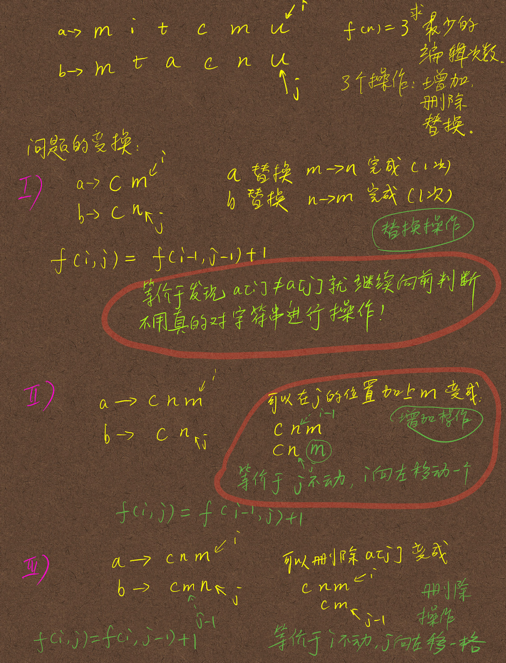
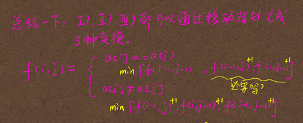
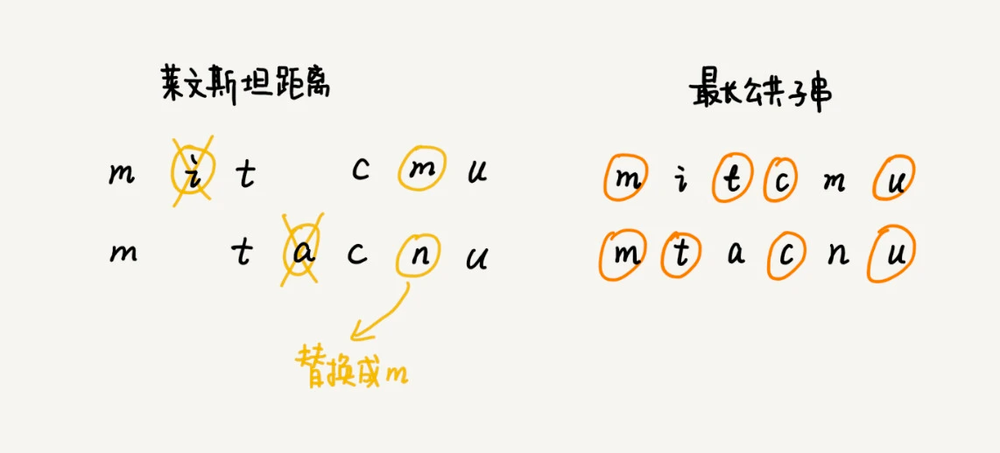

# 编辑距离

顾名思义，编辑距离指的就是，将一个字符串转化成另一个字符串，需要的最少编辑操作次数（比如增加一个字符、删除一个字符、替换一个字符）。编辑距离越大，说明两个字符串的相似程度越小；相反，编辑距离就越小，说明两个字符串的相似程度越大。对于两个完全相同的字符串来说，编辑距离就是
0。

## LevenshteinDistance

- 莱文斯坦距离允许`增加、删除、替换`字符这三个编辑操作
- 红绿灯,O(nm),双指针
- f(i,j) =
    - if a[i] == a[j] min{f(i-1,j)+1, f(i,j-1)+1,f(i-1,j-1)}
    - if a[i]!= a[j] min{f(i-1,j-1)+1,f(i-1,j-1)+1,f(i,j-1)+1}

## Longest Common Substring Length

- 最长公共子串长度只允许`增加、删除`字符这两个编辑操作
- 红绿灯,O(nm)，双指针

