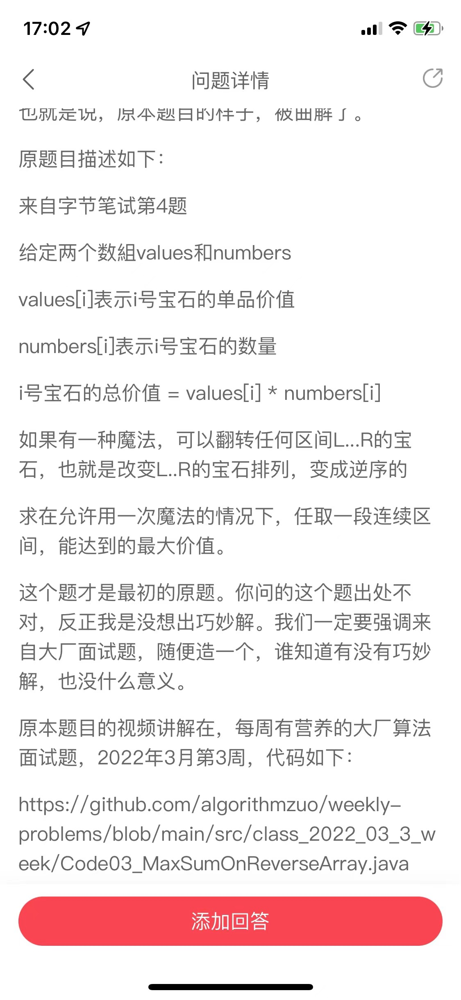
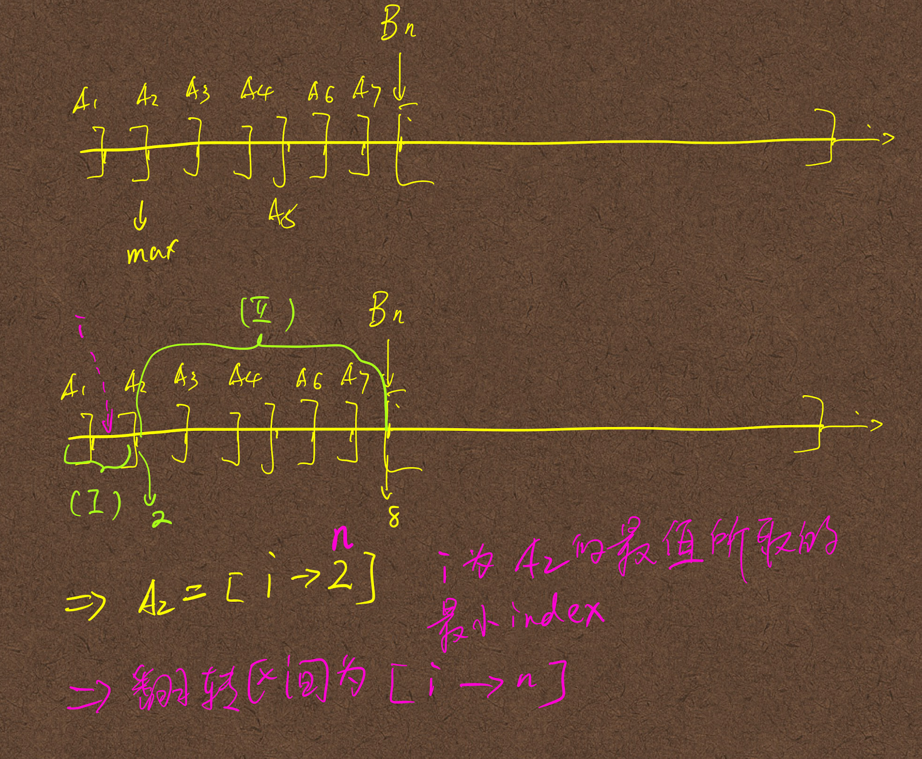

### 描述
>给定一个数字序列，求一个区间[i,j]将这个区间逆序以后，所得到的新序列中的最大连续子串的和最大。
> 
>求这个区间[i,j]

- 这是连续子串问题，所以可以用`包含DP`法解决
- 将原始序列`从头`与`从尾`分别求出中间数组`A`与`B`
  - Ai是从头开始，包含a[i]的最大子串和max{ai,ai->ai-1,ai-ai-2,.....ai-1}
  - Bi是从尾开始，包含a[i]的最大子串和max{bi,bi->bi+1,bi->bi+2,...,bi->bn}
- 设g(n)是max(0->n){Ai},就是前n个项的A(i)最大值
- 则f(n) = g(n-1)+B(n)的含义是翻转g(n-1)到n这个区间的元素，能够达到的最大子串的和
- 整体的解是max(0->n){f(i)}

## 一个重要的前提是
- 翻转的区间[i,j]一定另一个最大区间合并成一个最佳解。
- 任何一个最佳解都可以通过一次翻转跟另一个区间组合成一个整体的最佳解
- 如果不记得了就看这个[视频](https://www.mashibing.com/study?courseNo=1052&sectionNo=53198&systemId=21)

