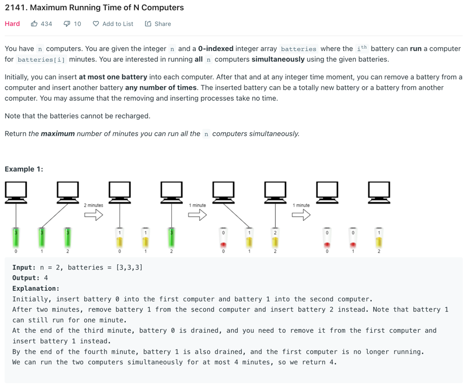
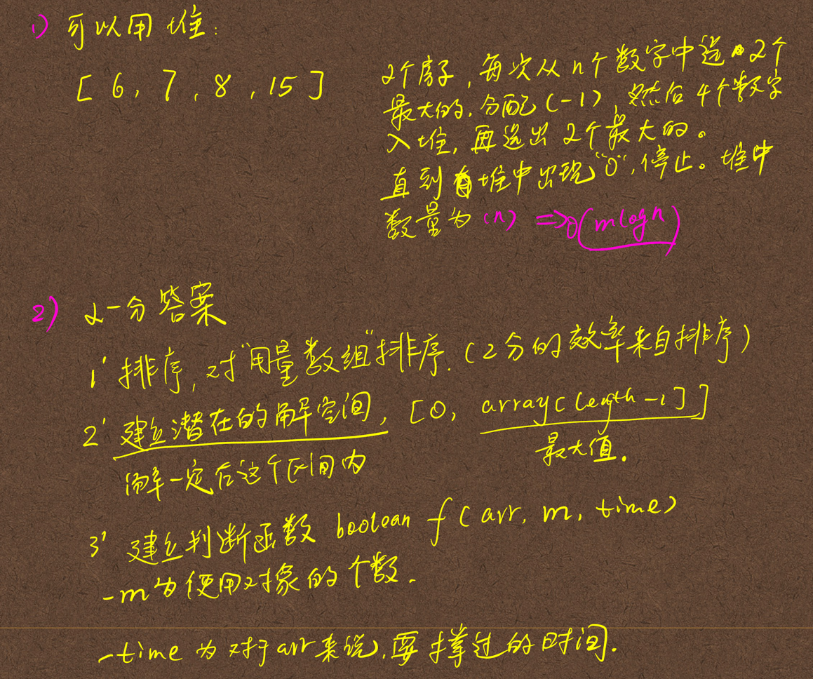
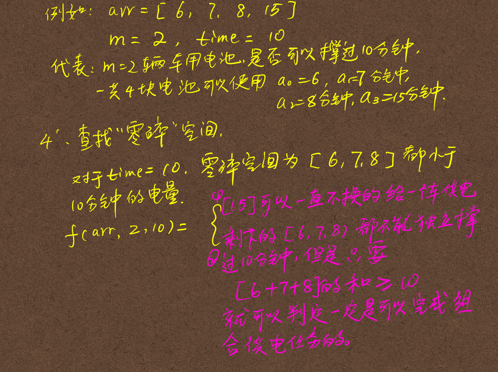
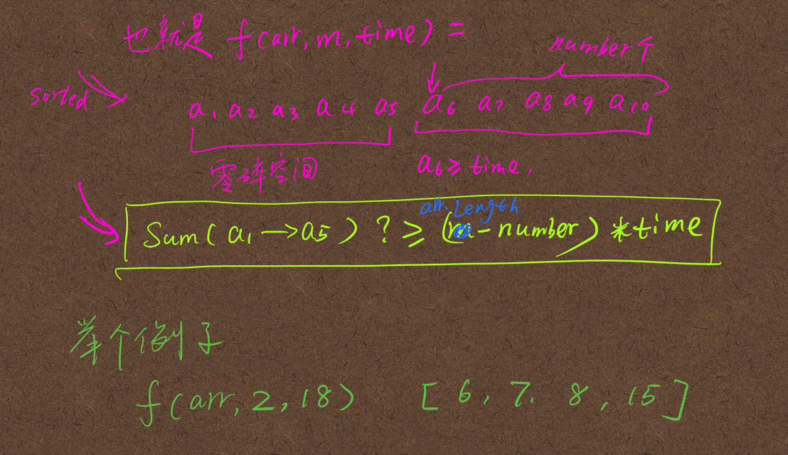
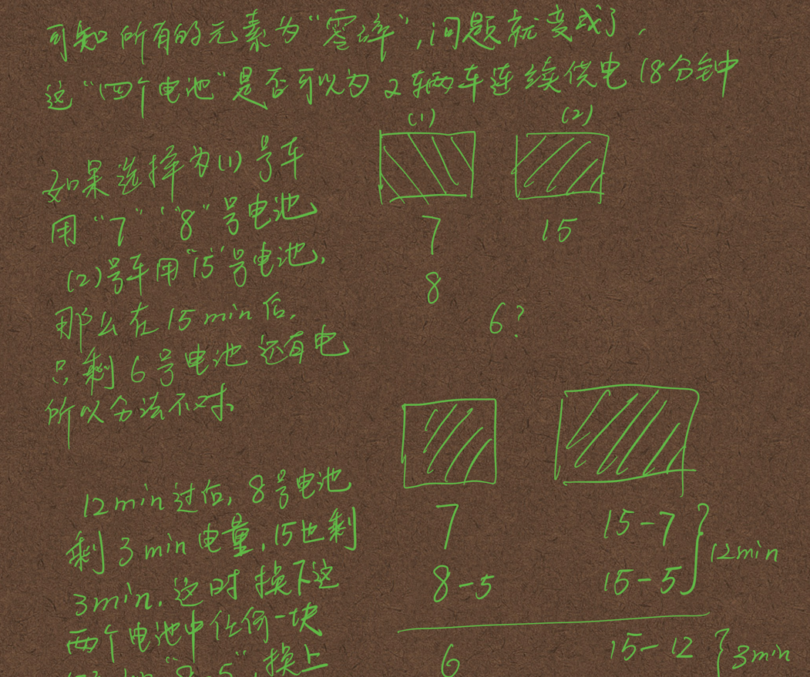
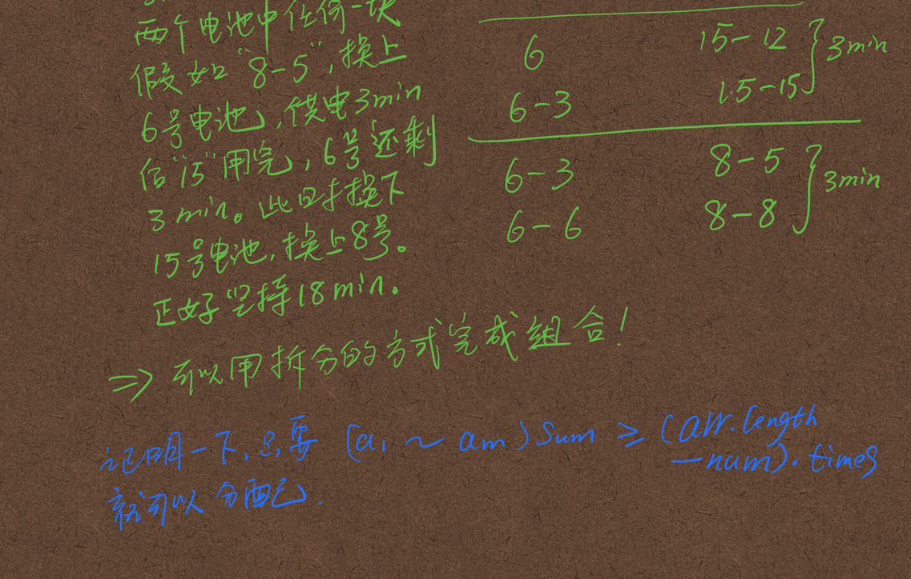
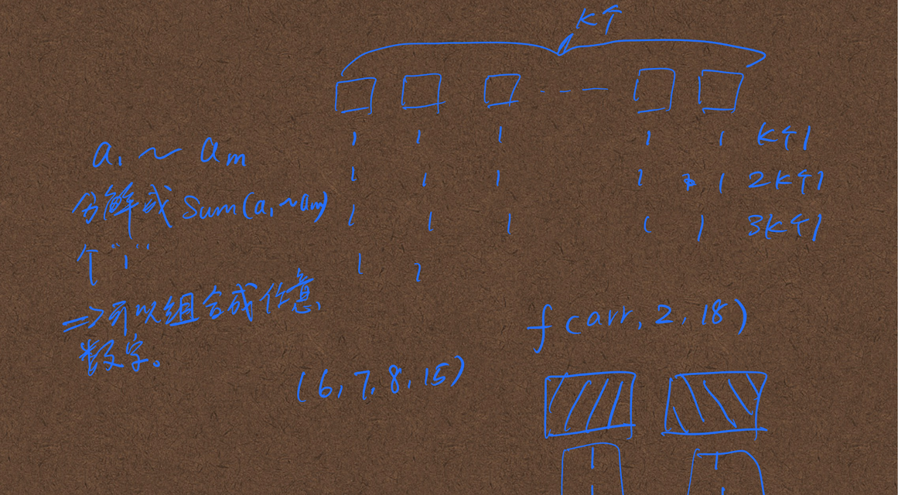
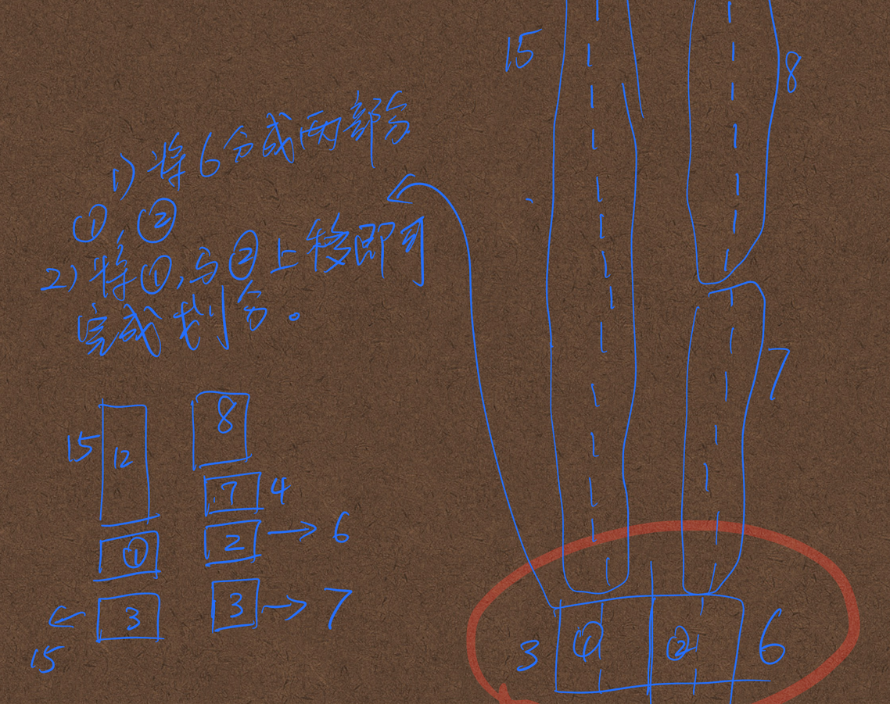

## 问题
- [左的](https://github.com/algorithmzuo/weekly-problems/blob/main/src/class_2022_04_1_week/Code01_FourNumbersMinusOne.java)
  - [马士兵的课堂链接](https://ke.qq.com/webcourse/index.html#cid=4122671&term_id=104714709&taid=13021404542724143&type=1024&vid=387702298773008545)
- [leetcode测试链接](https://leetcode.com/problems/maximum-running-time-of-n-computers/)

## 解法
- 应该可以用堆
- 二分答案

