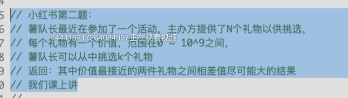

## 二分答案法
- 价值最接近的两件礼物之间的差值，就是排序后的，相邻的两个礼物之间的差值
- 价值最接近的两件礼物，表示选择k个礼物后，表示对于选中的k个礼物中，差值最小的两个礼物拿出来比较；跟谁比较？跟其他的k个礼物的组合中，差值最小的比较。

> [6,19,3,8,29]
> 
> k=2，表示必须从这5个数中选两件，比如[3,6]差值是3 显然比选择[3,29]要差；
> 
> k=3 选3个。比如：[3,6,19]这三个数中的值是：3，因为19-6>6-3。比[3,19,29]=10要差。问题是这么多选择中应该如何找到这个最大值得问题。
> 

## 二分法的规律
- 二分一般建立在有序数组基础上，有序是基础，所以一般就是O(nlogn)
- 一般能解决的问题是查找类问题。`而且查找的结果集是一个值，是离散的单值。跟DP有区别。因为DP的答案一般为一个组合，而且是递进关系的集合。`
- DP一般表现为排列组合问题中，几何级数上选择一个最优的解。子问题与父问题有递进的关系——子问题的解可以看做父问题解的一部分。
