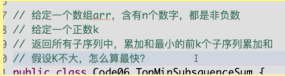

##前K小的子序列累加和
### 题

### 例子
> [2,3,1,1,2,5]
> 
- 看到子序列可以联想到`红绿灯`，排列组合，解空间是：{Cn1+Cn2+Cn3+Cn4...+Cnn} = 2^n - 1个组合
- 子序列下标有={[2],[3]....[5]-单个的，[2,3],[2,1],[2,2],[2,5]....-两个的，[2,3,1],[2,3,2],[2,3,5] ... -[三个的], .......-4个的....}
- 然后把对应的和求出来，最后排序，输出前K个小的子序列。
### 可以考虑下树的结构
- 二叉树的结构也是有指数特性的
- 二叉树可以穷举所有的组合

