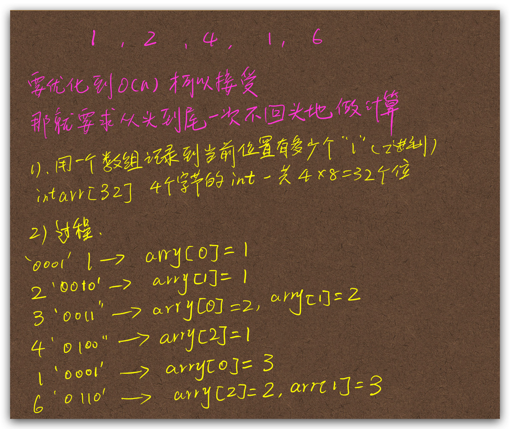
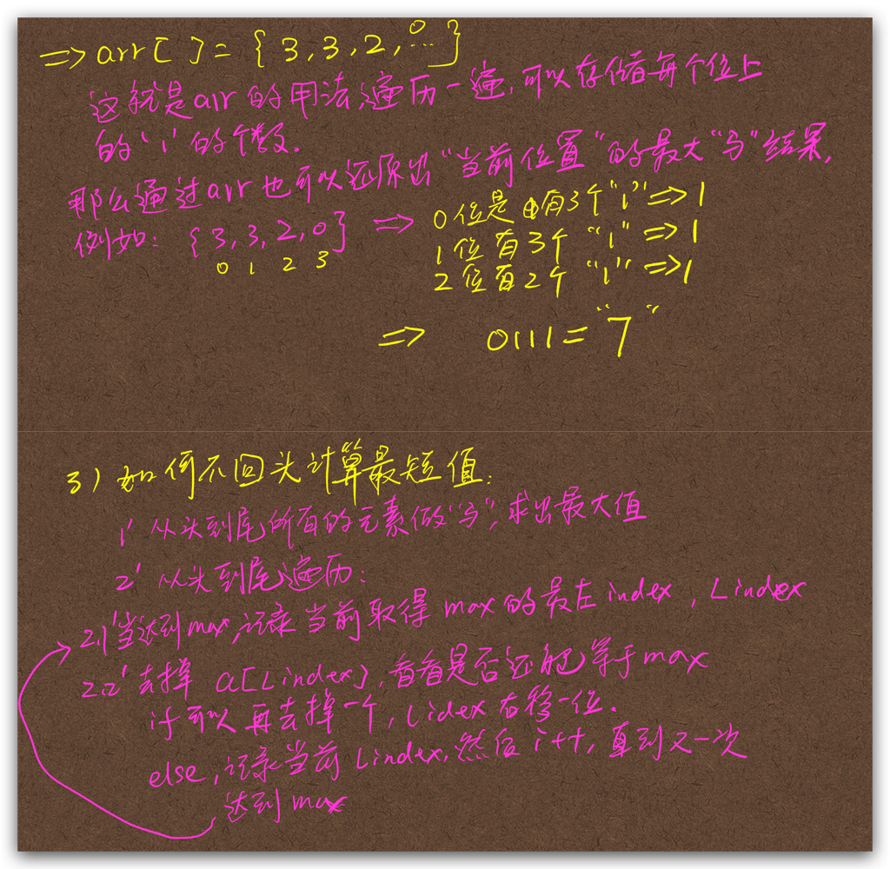

1,2，4，1，6
- 最大值就是n个数与在一起
- 最短的就是1，6这个子序列

###dp?
- 对于子串问题，很容易想到`包含`法解决问题
- 比如，最大连续子串和，最长回文等等，这个问题是否也可以用？
- 主要看是否子问题可以递归得到整体问题的解？
  - 1 3 2 6 这个问题来说，(1,3)是否是(1,3,2)这个问题解的一部分？或者可以推导出父问题的解呢？
  - 如果可以，那么就可以列出递推方程，然后可以看看是否有重复计算子问题，如果有就能DP了。
  - (0->i),i,i+1,---->n 这个结构如果可行就可以Dp了
  - 如果我们知道(0,i)的最短值，显然是推导不出(0,i+1)的最短长度的。
  - 例如，例子中(1,2,4,1,6)整体的最大值是7，前面(1,2,4,1)的最短值是3，为(1,2,4)
  - 但是如果到了(1,2,4,1,6)最短值就变成了2，为（1，6）这个子串；
  - 那么能否通过(1,2,4,1)这个子问题的解推导出(1,2,4,1,6)这个问题的解呢？
  - 加入6这个元素后，哪怕是直到前面最短的解是(1,2,4)也还是要计算(1,6)这个组合不然就漏了最佳解；
  - 更极端的情况是，如果在(1,2,4)这个解中间加入了很多不利于得到更短解的值，如：(1,2,4)(1,2,3,3,2,1)(1,6)中间的(1,2,3,3,2,1,1)都不能得到更短的解。但是当遇到6时，还是要向前去判断才能得出最短的解。也就是要去跟(1,2,3,3,2,1,1)去做与运算才行，时间复杂度最坏是O(n)级别。基本不可行。
  - 所以不能用DP来解。
- **所以也可以得到一个结论，如果从子问题推导到父问题的解的过程中如果量级太高就不能使用DP**

- 这个问题最坏的情况是O(n^2)
  - 就是枚举所有可能的连续子串
  - 计算每个子串的与运算
  - 找到最短的那个
  - 从(1)(1,2) (1,2,3),(1,2,3,4),(2),(2,3),(2,3,4),(3),(3,4),(4)这种结构
- 一个可行的解是：

